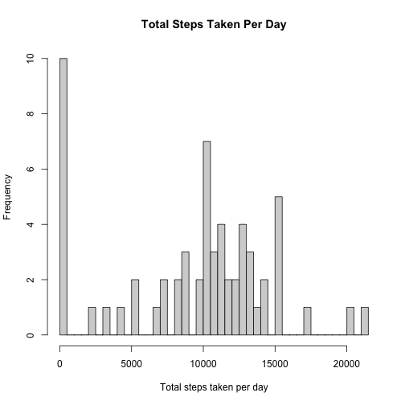
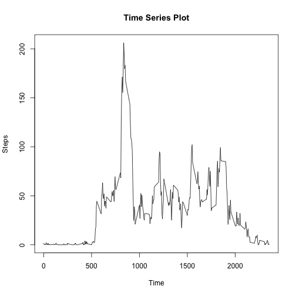
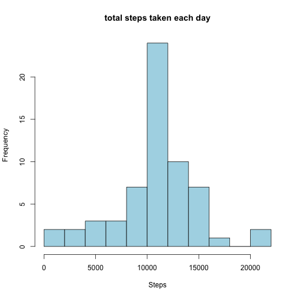
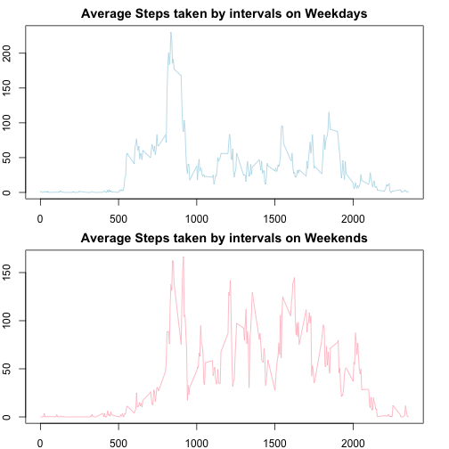

#Reproducible Reseach Project 1
Lin Xuan - 05/11/23 - Reproducible Research

## Loading and preprocessing the data


```r
getwd()
```

```
## [1] "/Users/xuanlin/Hallo/RepData_PeerAssessment1"
```

```r
activity <- read.csv("activity.csv")
```

## What is mean total number of steps taken per day?
First we aggregate the total steps by date, remove NA values.


```r
activityperday <- aggregate(activity$steps, by = list(activity$date), sum, na.rm = TRUE)

activityperday <- setNames(activityperday, c("Date", "Steps"))

print(activityperday)
```

```
##          Date Steps
## 1  2012-10-01     0
## 2  2012-10-02   126
## 3  2012-10-03 11352
## 4  2012-10-04 12116
## 5  2012-10-05 13294
## 6  2012-10-06 15420
## 7  2012-10-07 11015
## 8  2012-10-08     0
## 9  2012-10-09 12811
## 10 2012-10-10  9900
## 11 2012-10-11 10304
## 12 2012-10-12 17382
## 13 2012-10-13 12426
## 14 2012-10-14 15098
## 15 2012-10-15 10139
## 16 2012-10-16 15084
## 17 2012-10-17 13452
## 18 2012-10-18 10056
## 19 2012-10-19 11829
## 20 2012-10-20 10395
## 21 2012-10-21  8821
## 22 2012-10-22 13460
## 23 2012-10-23  8918
## 24 2012-10-24  8355
## 25 2012-10-25  2492
## 26 2012-10-26  6778
## 27 2012-10-27 10119
## 28 2012-10-28 11458
## 29 2012-10-29  5018
## 30 2012-10-30  9819
## 31 2012-10-31 15414
## 32 2012-11-01     0
## 33 2012-11-02 10600
## 34 2012-11-03 10571
## 35 2012-11-04     0
## 36 2012-11-05 10439
## 37 2012-11-06  8334
## 38 2012-11-07 12883
## 39 2012-11-08  3219
## 40 2012-11-09     0
## 41 2012-11-10     0
## 42 2012-11-11 12608
## 43 2012-11-12 10765
## 44 2012-11-13  7336
## 45 2012-11-14     0
## 46 2012-11-15    41
## 47 2012-11-16  5441
## 48 2012-11-17 14339
## 49 2012-11-18 15110
## 50 2012-11-19  8841
## 51 2012-11-20  4472
## 52 2012-11-21 12787
## 53 2012-11-22 20427
## 54 2012-11-23 21194
## 55 2012-11-24 14478
## 56 2012-11-25 11834
## 57 2012-11-26 11162
## 58 2012-11-27 13646
## 59 2012-11-28 10183
## 60 2012-11-29  7047
## 61 2012-11-30     0
```
We produce histogram to visualize the total steps taken per day.


```r
length(activityperday$Steps)
```

```
## [1] 61
```

```r
hist(activityperday$Steps, breaks = 61, xlab = "Total steps taken per day", ylab = "Frequency", main = "Total Steps Taken Per Day")
```


Lastly, we calculate the median and mean of the total steps taken per day. 


```r
summary(activityperday$Steps)
```

```
##    Min. 1st Qu.  Median    Mean 3rd Qu.    Max. 
##       0    6778   10395    9354   12811   21194
```

## What is the average daily activity pattern?
We first aggregate the steps by intervals, then plot the time series plot to show the average number of steps taken on interval basis.


```r
activitytrue <- na.omit(activity)
averageDailySteps <- aggregate(activitytrue$steps, by = list(activitytrue$interval), mean)
averageDailySteps <- setNames(averageDailySteps, c("interval", "averageSteps"))
plot(averageDailySteps$interval, averageDailySteps$averageSteps, type = "l", xlab = "Time", ylab = "Steps", main = "Time Series Plot")
```



Locate the max number of steps across intervals 


```r
max <- which.max(averageDailySteps$averageSteps)

max_time <- averageDailySteps$interval[max]

print(max_time)
```

```
## [1] 835
```


## Imputing missing values
1. Calculate the total number of NA values.

```r
nas <- activity[is.na(activity), ]
nrow(nas)
```

```
## [1] 2304
```
2. Use the mean for the 5-minute interval to fill in the NA values. Create a new dataset with no NA values. Plot the dataset with a histogram.

```r
imputedsteps <- averageDailySteps$averageSteps[match(activity$interval, averageDailySteps$interval)]

activity[is.na(activity)] <- imputedsteps[is.na(activity)]

eachdaysteps <- aggregate(activity$steps, by = list(activity$date), sum)

eachdaysteps <- setNames(eachdaysteps, c("date", "totalSteps"))

hist(eachdaysteps$totalSteps, breaks = 10, col = "light blue", main = "total steps taken each day", xlab = "Steps", ylab = "Frequency")
```



3. Calculate the mean and median of the total number of steps taken per day. 
The mean and median is both 10776. Compared to the first part of the assignment, the values present a difference between the data sets with NA values filled or unfilled. 

```r
summary(eachdaysteps$totalSteps)
```

```
##    Min. 1st Qu.  Median    Mean 3rd Qu.    Max. 
##      41    9819   10766   10766   12811   21194
```


## Are there differences in activity patterns between weekdays and weekends?
1. Create a new variable specifying weekdays and weekends.

```r
activity$date <- as.Date(activity$date, format = "%Y-%m-%d")

activity$DayType <- sapply(activity$date, function(x) {
  if(weekdays(x) == "Saturday" | weekdays(x) == "Sunday")
  {y <- "Weekend"}
  else {y <- "Weekday"}
  y
})
```
2. Make a panel plot in time series of the 5-minute interval and the average number of steps taken.

```r
weekday <- subset(activity, DayType == "Weekday")
weekend <- subset(activity, DayType == "Weekend")

averageweekday <- aggregate(weekday$steps, by = list(weekday$interval), mean)
averageweekend <- aggregate(weekend$steps, by = list(weekend$interval), mean)
averageweekday <- setNames(averageweekday, c("interval", "averageSteps"))
averageweekend <- setNames(averageweekend, c("interval", "averageSteps"))

par(mfrow = c(2, 1), mar = c(2, 2, 2, 2))

plot(averageweekday$interval, averageweekday$averageSteps, type = "l", col = "light blue", xlab = "Time", ylab = "Steps", main = "Average Steps taken by intervals on Weekdays")
plot(averageweekend$interval, averageweekend$averageSteps, type = "l", col = "light pink", xlab = "Time", ylab = "Steps", main = "Average Steps taken by intervals on Weekends")
```




